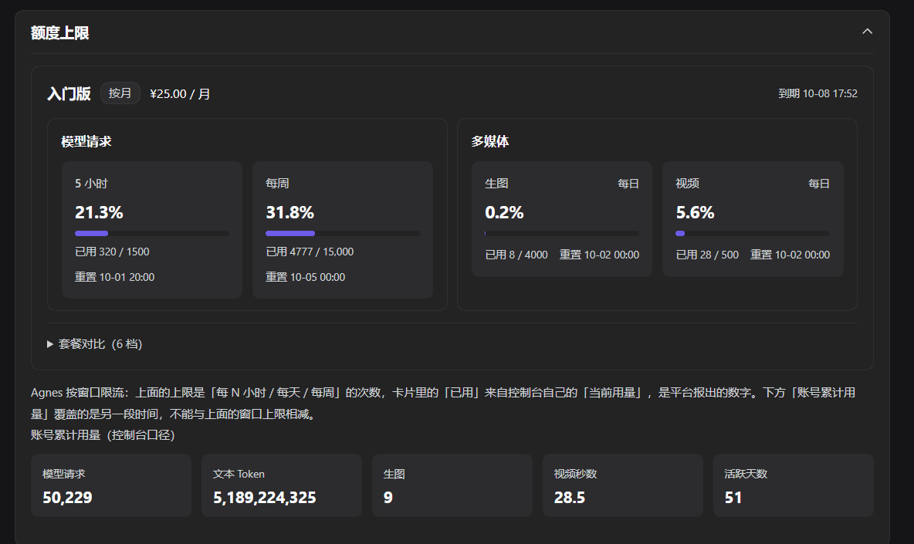
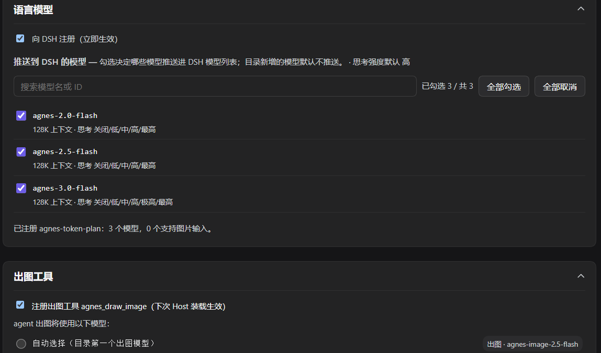
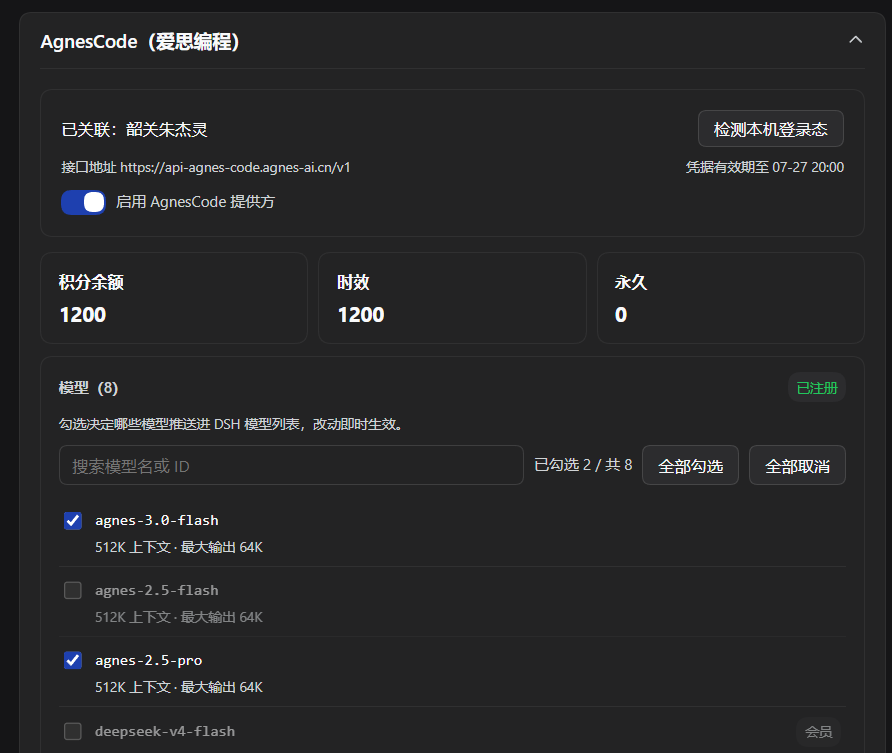

# dsh-connect-agnes-token-plan

把 Agnes 接进 DSH 的 **Plugins 页**插件卡：

- **积分额度**——登录一次，实时查看积分余额、额度窗口与每模型消耗，令牌自动续期，之后无需再管；
- **接入 API**——把爱思模型注册为 DSH provider，参与对话、出图与出视频；
- **Agnescode**——上游限流较宽松的另一条爱思办公产品线，独立账号、独立积分。

面板分三个 tab，按「先看数、再接入、最后可选加桌面端上游」排序：

## 积分额度

将 Agnes 的 Token Plan 接入dsh，，用超了只能等窗口重置。这个 tab 把数字搬进 DSH，写代码时不用切网页就能盯住：

- **额度窗口**：模型请求（5 小时滚动）、每周请求、生图与视频（各 24 小时），**平台报出已用量**、独立滚动，（含百分比与重置时间）
- **账号累计用量**：控制台口径的累计请求 / 文本 Token / 生图 / 视频秒数 / 活跃天数，以及近 N 天的分桶柱图
- **套餐对比**：平台**公开**的套餐目录（六档），无需登录即可读，用来回答"升级能买到什么"



首次使用在「连接 Agnes 控制台」填一次账号和密码（Agnes 不发 refresh token，续期就是自动重登一次）。登录失败时表单会直接显示 Agnes 返回的原因；密码错误属于**凭据型拒绝**，面板**绝不自动重试**（Agnes 有失败次数锁定）。想清除账号，用面板底部的按钮。

## 接入 API（可选）

把 Agnes 模型注册为 DSH provider，参与对话与出图。

- **模型清单**：在「API Key」卡粘贴 Key 保存`AGNES_TOKEN_PLAN_API_KEY`，Host 以 `agnes-token-plan` 之名注册 OpenAI 兼容 provider，模型列表随 `/v1/models` 自动刷新；
- **语言模型**：显示当前 Key 实际能调哪些模型，其中哪些能看图（按平台 `input_modalities` 判定，不靠名字猜）。
- **出图工具**：Host 给 agent 注册 `agnes_draw_image` ，出图模型按 catalog 的 `output_modalities` 结构化判定。
- **视频工具**：Host 给 agent 注册 `agnes_video_generate`，按选中模型分派 V2.0 / 2.5 两套互斥参数。
- 开关与勾选都在面板热生效，无需重启。但工具的实际挂载 / 缺席发生在**下一次 Host 启动**（agent tools 没有 unregister 语义）。细节见 [docs/SETUP.md](docs/SETUP.md) §3、[docs/PROVIDER-HOT-RELOAD.md](docs/PROVIDER-HOT-RELOAD.md) 与 [docs/AGNES-API.md](docs/AGNES-API.md) §7.5。



注意：`sk-` 走 API 按量计费，`cpk-` 走订阅配额（本 tab 只读订阅配额），两类 Key 有独立限制池，需从官网了解实际限制。

## AgnesCode（可选，默认关）

**读取 AgnesCode 桌面端** 留在本机的加密会话文件，获取登录态，再以 provider id `agnescode` 注册**独立** provider、独立积分池——两条上游凭据互不相通：


1. **接口地址**：写在会话文件里、**按账号跟随**，钉死在 Agnes 域名族内，地址不对就拒绝使用；
2. **显示口径**：积分是**订阅池**（时效 + 永久）；模型清单带「会员」标记而不隐藏——会员门槛是账号状态，不是模型不存在；
3. **约 28 天续期一次**：JWT 过期后没有自动路径，开一次桌面 App、再点「检测本机登录态」重新采集即可。

协议探针记录见 [docs/ROADMAP.md](docs/ROADMAP.md) §6.3。



注意：检测不到登录态时，面板会逐条列出探测过哪些文件、各自为什么没成（「没装 App」「解不开密」「会话里没有令牌」是三种不同的处理）；

## 边界

- 面板**不代你操作账务**——不改套餐、不代扣额度、不碰 Key 明文；数据来自 Agnes 控制台自己的 API，与网页控制台口径一致。
- 注册 provider、挂出图工具、挂视频工具、接桌面端上游，全部 opt-in 且**默认关闭**；一个都不打开时，插件退化为纯信息展示。

## 安装

1. 在 DSH「插件」页搜索 `dsh-connect-agnes-token-plan` 点击安装，或运行：

   ```powershell
   dsh plugin --profile web add dsh-connect-agnes-token-plan       # Web 端
   dsh plugin --profile desktop add dsh-connect-agnes-token-plan  # 桌面端
   ```

2. **完全退出 DSH（含托盘）再启动**。

3. 打开 DSH 的 **Plugins 页**，找到 `dsh-connect-agnes-token-plan` 的插件卡（面板是页内的内联卡片，**不在侧边栏**）。

> 装到的是哪一版由源决定：安装器会询问 profile 配的 registry，**默认含 `registry.npmmirror.com`，刚发布的版本在镜像上可能延迟几分钟**，官方源立即可用；要确认拿到了哪一版，对照 `npm view dsh-connect-agnes-token-plan version --registry=https://registry.npmjs.org`。三种 target 形态（npm 包名 / git 地址 / 本地路径）见 [docs/SETUP.md](docs/SETUP.md)。

## 它是怎么工作的

登录原理：
- Host 在后台向 `{consoleBase}/api/user/login` 发**一次**账号密码 POST 换取 access token（Agnes 没有 OIDC 跳转、没有 refresh token），令牌过期或被拒时用同一路径**重登一次**；
- `/api/cn/user/subscription` 直接返回每个窗口的 `used` / `limit` / `reset_at` / `usage_pct`（控制台「当前用量」那一屏的数据源），面板逐字转写、不做减法。下方的「账号累计用量」统计同理，
- 面板打开时才轮询一个只读本地路由，关掉即停。协议细节（一跳登录、密码明文过 TLS 与「不落盘」纪律、防锁号节流）见 [docs/AUTH.md](docs/AUTH.md)，接口契约见 [docs/AGNES-API.md](docs/AGNES-API.md)。


## 运维诊断：这台机器现在挂没挂 provider？

provider / 出图开关的生效值存在插件私有状态文件里（`$DSH_HOME/state/<name>/`），不在任何配置或路由上——查"到底开没开"用 doctor，它只读状态文件、不碰凭据，Host 没起也能跑：

```powershell
npm run doctor          # 人读：每个 profile 的 provider / draw / video / agnescode 开关与模型清单
npm run doctor:json     # 机器读：JSON（可进你的巡检 / 工单脚本）
```

## 文档

- [docs/ARCHITECTURE.md](docs/ARCHITECTURE.md) — 架构与数据流
- [docs/SETUP.md](docs/SETUP.md) — 配置字段、改动后重启、常见信号
- [docs/AUTH.md](docs/AUTH.md) — 登录 / 重登 / 节流设计
- [docs/API.md](docs/API.md) — 路由与控制台端点
- [docs/AGNES-API.md](docs/AGNES-API.md) — Agnes 接口全集（控制台额度侧 + 推理侧）
- [docs/TESTING.md](docs/TESTING.md) — 测试体系
- [docs/PITFALLS.md](docs/PITFALLS.md) — 真实踩坑（47 条）
- [CHANGELOG.md](CHANGELOG.md) — 版本变化

AI 协作会话请先读 [AGENTS.md](AGENTS.md)。

## 诚实声明

- 面板显示的是**控制台自己的口径**，与网页控制台一致；`GET /v1/models` 只区分权限，不计费也不占推理额度；
- 令牌被拒时面板明确提示重新登录，而不是静默显示旧数据；
- 凭据（账号、access token）只经 DSH 凭据服务保存，**密码不落盘**；本插件不写任何明文凭据文件或调试日志。

## 许可证

MIT License（Copyright (c) 2026 eghrhegpe），全文见 [LICENSE](LICENSE)；第三方依赖与合规说明见 [THIRD_PARTY_NOTICES.md](THIRD_PARTY_NOTICES.md)。
